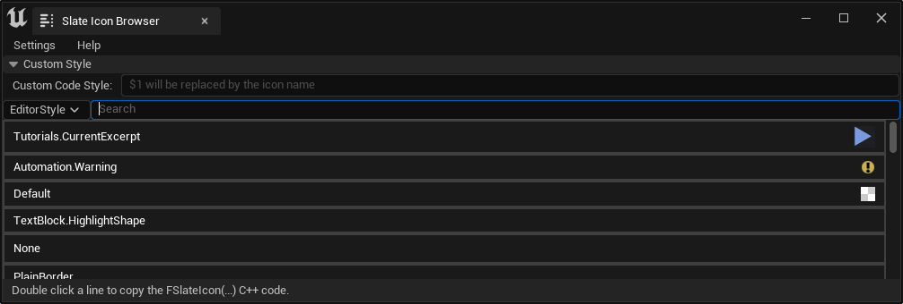

# Slate Icon Browser

This small tool lets you browse Unreal Engine's Editor icons/brushes easily, search for specific ones and copy slate code for the selected icon.

## Invocation

When the plugin is activated there's only one window which you can open via `Tools -> Slate Icon Browser`.

## Features

### Searching

Using the search bar it's possible to filter the icons based on their names.

### Select a Style Set

Using a dropdown menu you can select another style set besides the default Editor style.

### Non-Image Brushes

Non-image brushes (like solid colors) will be displayed with a default size as a simple square.

### Copying Slate Code

Slate Icon Browser supports multiple code copying styles:

* `FSlateIcon(...)`
* `FSlateIconFinder::FindIcon(...)`
* Custom style

The first two are quite obvious: They allow copying C++ code like the following:

    FSlateIcon(FAppStyle::GetAppStyleSetName(), "Icon")
    FSlateIcon(FName("SomeStyle"), "Icon")
    FSlateIconFinder::FindIcon("Icon")

A few default styles will be replaced by the generic class call (like `FAppStyle::GetAppStyleSetName()`) while others will be copied as a FName reference instead (using `FName("SomeStyleSet")`).

_Custom Style_ is a little different: It allows you to specify a code fragment manually in a separate input field.
In this input field, the string `$1` will be replaced by the code of the icon.

All three copy styles are also available in the context menu that appears by right-clicking a list entry.

As with everything source-code related you are supposed to read it before you include it and adjust it to make it work in your environment.

---

# Source Code and License

The source code is licensed under the MIT license and is hosted at <https://github.com/sirjofri/SlateIconBrowser>.
See also the [License.txt](https://github.com/sirjofri/SlateIconBrowser/blob/master/License.txt) file inside the repository for the full license text.